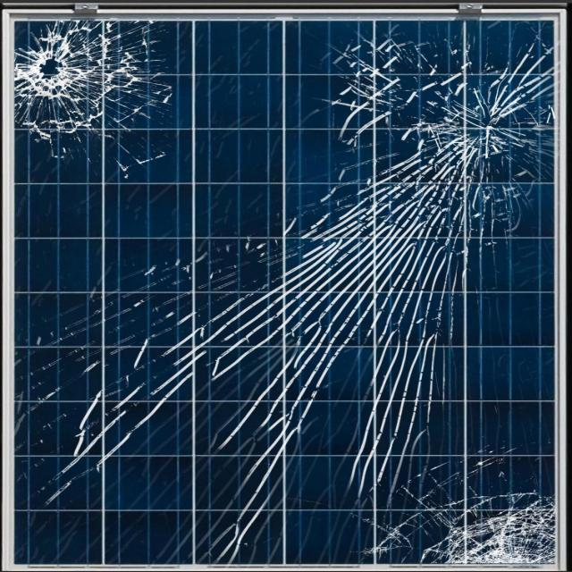
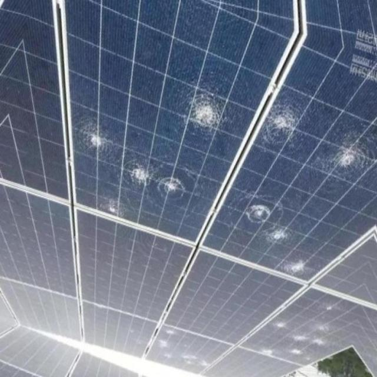
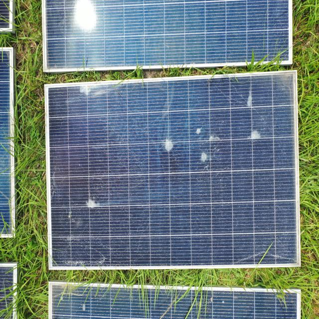

# 태양광 패널 오염 감지 시스템

**SDGs #7 : Affordable and Clean Energy<br/>**

### 기술 스택


## 백본 네트워크

[YOLOv10: Real-Time End-to-End Object Detection](https://arxiv.org/abs/2405.14458)\
Ao Wang, Hui Chen, Lihao Liu, Kai Chen, Zijia Lin, Jungong Han, and Guiguang Ding\
[](https://arxiv.org/abs/2405.14458) [](https://colab.research.google.com/github/roboflow-ai/notebooks/blob/main/notebooks/train-yolov10-object-detection-on-custom-dataset.ipynb#scrollTo=SaKTSzSWnG7s)


## 데이터셋


### 활용 데이터셋 : Panel Solar Dataset

- **Source:** [Panel Solar Dataset](https://universe.roboflow.com/susan-ifblr/panel-solar-bw945), [Solar panel dirt det](https://universe.roboflow.com/alex-jcvyb/solar-panel-dirt-det)


- **데이터셋 수량**:
  - Test : 7,595장
  - Validation : 404장
- **손상 종류**: 3개 (Bird-drop, Crack, Dusty)
- **예시 이미지**
<p align="center">
  
  
  
</p>
## 모델 아키텍처

- **사용 모델**: YOLOv10n
- **하이퍼파라미터 설정**:
  - 학습률: 0.01
  - 배치 크기: 256
  - 옵티마이저: AdamW
  - 이미지 크기: 720 x 720


## 모델 학습

- **학습 환경**:
  - CPU: Intel(R) Xeon(R) Silver 4214R CPU @ 2.40GHz
  - RAM: 220GB
  - GPU: NVIDIA A6000 48GB
- **Epochs**: 114회 (Early Stopping 적용)
- **손실 함수**: Bounding Box Regression Loss, Objectness Loss, Classification Loss
- **Data Augmentation**:
  - 랜덤 회전 변환
  - 스케일 변환
  - 평행 이동


## 성능 평가

| 지표            |Bird-Drop |Cracked|Dusty|종합
|-----------------|-----------|-----------|----------|----------|
| Precision       | 84.3%     | 84.3%     |92.3%     |88.4%     |
| Recall          | 83.3%     | 64.1%     |68.0%     |76.0%     |
| mAP@0.5         | 89.4%     | 76.2%     |88.4%     |84.2%     |


- **전체 mAP**: 84.2%


## 모델 배포

모델은 Flask 기반의 RESTful API로 배포되었으며, `/process_image` 엔드포인트를 통해 이미지를 POST하면 JSON 형식의 탐지 결과를 반환합니다.

- **엔드포인트**: `POST /process_image`
- **요청 데이터**: 이미지 파일 (`image` 필드로 전송)
- **응답 데이터**:
  - `processed_image`: 탐지 결과가 표시된 이미지 (Base64 인코딩)
  - `detections`: 탐지된 객체 정보 (라벨, 신뢰도, 바운딩 박스 좌표)

---

## 사용 방법


#### Python 버전 및 가상환경 설정


- **가상환경 생성**: YOLOv10 가상환경을 설치합니다.
```
cd ./flask_web/yolov10
conda create -n yolov10 python=3.9
conda activate yolov10
pip install -r requirements.txt
pip install -e .
```

- **실행** :
```
flask_web 디렉토리로 이동
python app.py
```

- **탐지 예시** :
<p align="left">
  
</p>
